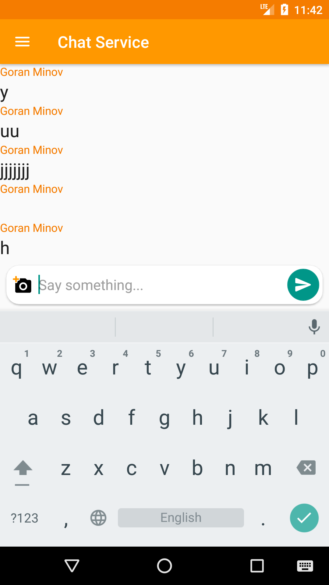
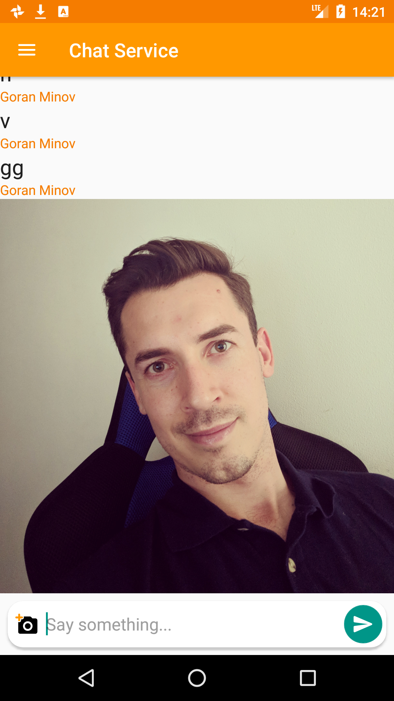
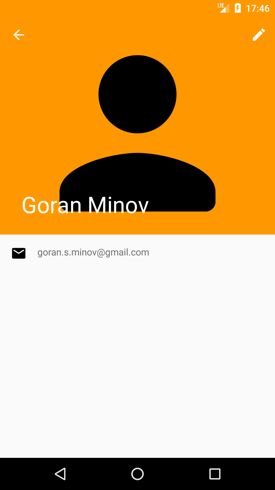

# Pre alpha app in progress...

Simple Android chat app where the user will be able to create a personal "space", share / invite a friend to that "space"
so they can have a private conversation. The users will be able to create and join as many "spaces" as they want and no phone
number will be required to join.


### Main goal of the app is to show the power of Firebase

#### As for now:
- The app has no name :x:
- Firebase AuthUI implemented :white_check_mark:
- Firebase Crashlytics implemented :white_check_mark:
- Firebase Database partially implemented :white_check_mark:
- Firebase Cloud Storage partially implemented :white_check_mark:
- The app is able to send and receive messages, both text and picture messages under only one demo room :white_check_mark:
- Added profile with only read options, edit and profile image to follow :white_check_mark:
- No other features implemented :x:

#### Screenshots:
  

The app uses Glide for displaying images

### License
```MIT License

Copyright (c) 2018 Goran Minov

Permission is hereby granted, free of charge, to any person obtaining a copy
of this software and associated documentation files (the "Software"), to deal
in the Software without restriction, including without limitation the rights
to use, copy, modify, merge, publish, distribute, sublicense, and/or sell
copies of the Software, and to permit persons to whom the Software is
furnished to do so, subject to the following conditions:

The above copyright notice and this permission notice shall be included in all
copies or substantial portions of the Software.

THE SOFTWARE IS PROVIDED "AS IS", WITHOUT WARRANTY OF ANY KIND, EXPRESS OR
IMPLIED, INCLUDING BUT NOT LIMITED TO THE WARRANTIES OF MERCHANTABILITY,
FITNESS FOR A PARTICULAR PURPOSE AND NONINFRINGEMENT. IN NO EVENT SHALL THE
AUTHORS OR COPYRIGHT HOLDERS BE LIABLE FOR ANY CLAIM, DAMAGES OR OTHER
LIABILITY, WHETHER IN AN ACTION OF CONTRACT, TORT OR OTHERWISE, ARISING FROM,
OUT OF OR IN CONNECTION WITH THE SOFTWARE OR THE USE OR OTHER DEALINGS IN THE
SOFTWARE.```
